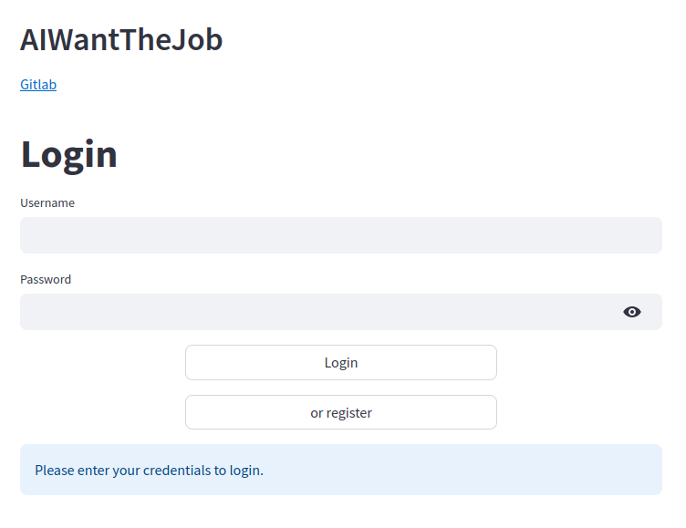
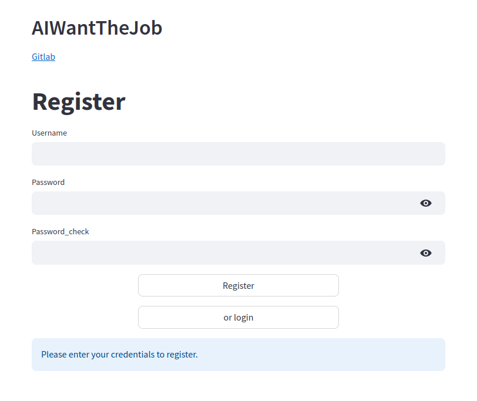
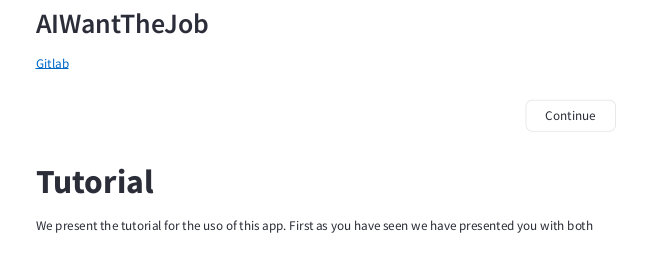
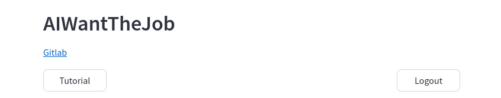
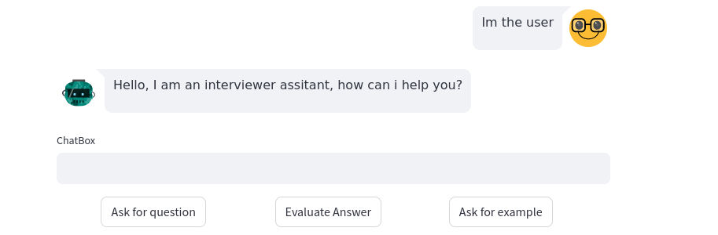
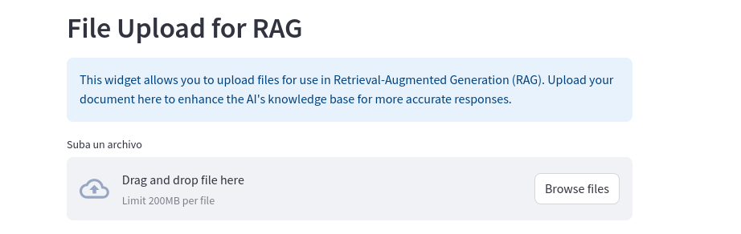
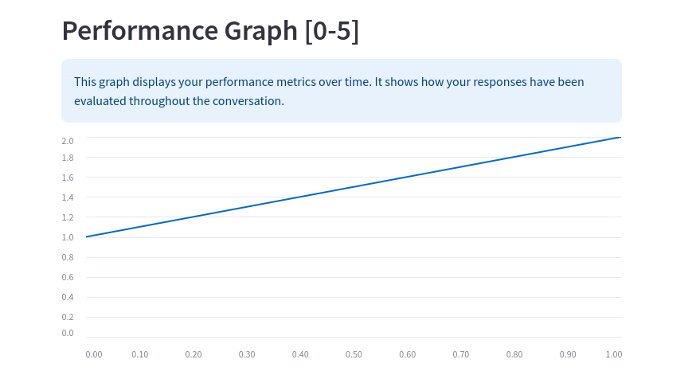

# USC-AIWantTheJob

Este proyecto se corresponde con el TFG AIWantTheJob de la USC en combinación con HP SCDS. Es un proyecto que tiene como objetivo realizar el desarrollo de un simulador de entrevistas donde el usuario puede interactuar con un entrevistador basado en IA. Para realizar esta tarea hemos empleado modelos de lenguaje ya existententes (siendo nuestro modelo por defecto llama2). Para lograr la simulación de un entrevistador hemos empleado dos pilares clave:

- Por un lado ofrecemos técnicas de RAG para poder dotar al entrevistador de cualquier conocimiento quer se quiera. Este conocimiento se puede establecer tanto desde el lado del servidor como del lado del cliente.
- Por otro lado empleamos un gestor de comportamientos basado en Nemo GuardRails con el que acotamos el comportamiento de los modos del entrevistador (los cuales se han definido como: entrevistador pregunta, entrevistador evalua, entrevistador realiza un ejemplo de como responde su propia pregunta)

## Guía de Usuario

### Acceso

Si eres un usuario que simplemente quiere acceder a la aplicación web, lo más probable es que te pasen una URL con el enlace a la página. Por defecto, este enlace es

```
http://localhost:8501/
```

ya que la aplicación suele correr en local.

Como lo más probable es que el propio usuario sea el que está lanzando la aplicación en este caso, se presenta en el apartado de Guía de Despliegue ya que en los métodos de despliegue se hace ya la conexión automáticamente

### Guía de uso | Componentes de la GUI

El punto de acceso de la aplicación es una interfaz de login típica. En esta interfaz podemos conectarnos a nuestra cuenta si ya la tenemos creada o podemos redirigir a la creación de cuenta en caso de que así sea.



En caso de querer realizar el registro nos situamos de nuevo en una página de registro bastante estandarizada donde podemos crear la cuenta para la que solamente necesitamos usuario y contraseña o podemos volver al login.



Desde el registro antes de acceder al entrevistador, se presenta un tutorial que se corresponde bastante con este apartado para explicar como funcionan los componentes en caso de que no sea los suficientemente claro. Para pasar el tutorial hay un boton claro donde pone continuar para pasar directamente al chat. (En el login se pasa directamente al entrevistador)



Lo primero que encontramos en la página del chat es el nombre y el enlace del repositorio de gitlab en el que se ha desarrollado. A mayores podemos encontrar dos elementos. Un boton para cerrar sesión y un boton para volver al tutorial descrito en el punto anterior.



Bajando para abajo observamos el chat que se corresponde con el entrevistador. Ofrecemos las tres opciones descritas anteriormente

- Un boton para generar la pregunta en el que nosotros tenemos que escribir el tema de la pregunta (este pude ser un extracto de texto de longitud considerable) 
- Un boton para enviar una respuesta y que el entrevistador evalue dicha respuesta para ver cual es su calidad (de este punto extraemos las puntuaciones que veremos en un futuro)
- Un boton con el que podemos pedir que sea el propio entrevistador el que responda la pregunta que ha hecho para ver una posible respuesta. Para este apartado da igual lo que escribamos en el textbox



Bajando para abajo, vemos un widget con el que podemos subir nosostors conocimiento sobre el que queremos que el entrevistador nos realice preguntas



Y por último podemos ver una gráfica en la que podemos ver el historial de progreso que hemos tenidoo hasta el momento



#### Demo

<video width="320" height="240" controls>
  <source src="./demo_video/Ejemplo_Uso.webm" type="video/mp4">
</video>


### Consideraciones de uso

La aplicación requiere del empleo de un modelo de lenguaje de un tamaó considerable. Los tiempos de respuesta pueden variar entre 5 y 30 segundos aproximandamente

Mientras está esperando la respuesta se observaŕa un icono que pone running en la esquina derecha


## Guía de Despliegue

Para usar la aplicación se ofrecen 4 métodos diferentes.

### Instalación y runeo manual

Para ello primero hay que instalar las dependencias

```sh
pip install --no-cache-dir -r requirements.txt
```

Después runearemos el backend

```sh
cd /backend
python3 main.py "token_de_hugging"
```

Por último runearemos el frontend

```sh
cd /frontend
streamlit run index.py
```

### Entorno virtual

En este modo se instalará conda y se realizarán las operaciones en un entorno virtual

Nos vamos a scripts

```sh
cd /scripts
```

Instalamos conda

```sh
./conda_install.sh
```

Construimos el entorno

```sh
./build.sh
```

Lo ejecutamos

```sh
./run.sh "token_de_hugging"
```

## Configuración NAIVE

Si queremos habilitar el comportamiento dinámico del entrevistador hay que realizar los siguientes cambios:

En ```backend/modelo_ia/NemoConfig.py```

```py
12:         self.COLANG_CONFIG = self._set_colang_config("hardcoded_colang.co") # NAIVE COLANG AQUI PARA CAMBIAR DE CONFIG

# transformar en

self.COLANG_CONFIG = self._set_colang_config("naive_colang.co")
```

En ```backend/modelo_ia/Generic_llm.py```

```py
# Descomentar
133: self.summarize = self._set_callback("Please summarize the topic of the following text")
```

En ```backend/modelo_ia/Nemo_Core.py```

```py
# Intercambiar los comentarios (comentar la primera descomentar la segunda)
67:
self.register_actions(
    [self.LLM.question_response, self.LLM.punctuate_answer, self.LLM.emulate_answer],
    ["bot_response", "user_answer", "bot_answer"],
    [True, False, False]
)
"""
# Para el naive
self.register_actions(
    [self.LLM.question_response, self.LLM.punctuate_answer, self.LLM.emulate_answer, self.LLM.summarize],
    ["bot_response", "user_answer", "bot_answer", "summarize"],
    [True, False, False, False]
)
```

# Guía de desarrollador

## Estructura del respositorio

# Distribución de archivos del backend

```sh
| backend/
| --> main.py
| --> setup.py
| --> README.md
| --> api
| --- --> api.py
|
| --> archivos/
|
| --> database/
| --- --> database.py
| --- --> data/
| --- --- --> sqlite databases
|
| --> helpers/
| --- --> ftpserver.py
| --- --> number_grabber.py
| --- --> parser.py
|
| --> modelo_ia/
| --- --> engine_proxy.py
| --- --> generic_llm.py
| --- --> nemo_config.py
| --- --> nemo_core.py
| --- --> prompt_template.py
| --- --> pseudo_cache.py
| --- --> vector_store.py
```

## main.py

Fichero principal que es el que runnea el programa

```py
python3 main.py "token_hugging"
```

## setup.py

Declara los requisitos y los paquetes de los modulos, en caso de querer instalarse simplemente esta parte del programa

```sh
cd backend
pip install .
```

## README.md

Este fichero

## archivos

Contiene el archivo que se va a usar como contexto general para el modelo (server-side). Es donde se suben los archivos del client side, también de contexto.

# Modelo IA

## engine_proxy.py

Intermediario absoluto del backend. Sirve para conectar cada uno de los componentes entre si

```py
proxy = Proxy(...)

# invocacón al modelo interno
proxy.get_data(texto, argumentos, id) 

# acceso (y operaciones) sobre la base de datos
proxy.registrar_usuario(nombre, contraseña)
     .validar_usuario(nombre, contraseña)
     .insertar_valor_array(user_id, valor)
     .recuperar_valores_array(user_id)
```

## generic_llm.py

Define de manera genérica un modelo de lenguaje (LLM) de huggingface. Permite al usuario instanciar cualquier tipo de modelo. 

Si el modelo es de tipo instruct y tiene *chat_template* habilitado es super simple, simplemente pones el nombre y ya está. Si el modelo NO tiene el chat_template, tienes que modificar el fichero en callback -> template al template de hugging que aparece en la página descriptiva del modelo:

```py
def _set_callback(self, sysprompt,
    template="copiar aquí template"
)
```

Funciones de interés

```py
modelo = LLM(...)

#definir un callback
callback = LLM._set_callback("sysprompt")

#usar el callback
respuesta = callback(pregunta)
```

## nemo_config.py

Define la estructura/configuración del engine del Nemo. Tocat la *COLANG CONFIG* si se quiere modificar el flujo de la conversación

```py
config = NemoConfig("nombre modelo")
```

## nemo_core.py

Core del sistema de nemo empleado. Basicamente se usa NemoGuardRails para guiar el flujo de conversación del agente (chatbot). En este archivo se define además como interactúa el LLM con el contexto (RAG).

```py
Nemo = NemoCore(...)

# metodo de uso
respuesta = Nemo.processCall(texto, argumento)

# actualización de la base de conocimientos del client-side
Nemo.update_db(path_al_document) # se sube con ftp
```

A la hora de registrar los callbacks dentro del nemo (*NemoGuardRails.register_action()*), primero le hacemos un setup de todos los contextos que tengamos definidos dentro de la base de datos vectorial

## prompt_template.py

Contiene strings absolutos que se corresponden a los sysprompts a emplear dentro del sistema.

Se pueden añadir todas las que uno quiera

```py
PromptTemplates.nombre_template
```

## pseudo_cache.py

Clase pensada para agilizar algunas consultas (ya que uno de los problemas de ejecutar esto en un portatil es la falta de velocidad).

La idea es pre-cargar alguna respuesta mientras el usuario hace tareas en el front para emular así una pre-carga de la cache. En este caso se pre-supone que si el usuario quiere una respuesta, ahorraremos algunos segundos mientras que si quiere una evaluación, la pre-carga (fallida) no causará delays porque acabará antes de que el usuario escriba su propia respuesta a evaluar.

```py
cache = Cache(...)

# preparar la cache
cache.prepare_example("pregunta")

# acceder al contenido (espera a que se carge si no ha terminado)
cache.get_context()
```

## vector_store.py

Clase base de datos vectorial basada en ChromaDB (uno de los nombres más estándar de la industria.) Chroma usa una base sqlite por detrás.

La idea es que la base de datos tenga 3 colleciones. Una del contexto del cliente, una del contexto del Servidor y una de preguntas.

Cliente y servidor son teóricamente volátiles mientras que la de preguntas es permanente.

```py
vs = VectorStore(...)

# subir un archivo a una colección
vs.load_and_embed("archivo", "nombre de la colección", ...)

# acceder a todos los contextos
vs.get_context("texto", ...)

# añadir una pregunta a la colección permanente
vs.add_question("contexto de la pregunta", "pregunta")
```

Si se quiere que cliente y servidor sean persistentes, borrar la siguiente linea:

```py
#VectorStore -> load_and_embed
try:
    # Borramos la colección si existe (no deberia ser permanente)
    self.client.delete_collection(index_name)
except Exception:
    pass
```

# api

En la carpeta de la api encontramos el desarrollo hecho con Flask de como el cliente se comunica con la propia api

## api.py

Define las siguientes rutas:

```py
# chequeo de salud de la api
@app.route("/health")

# devuelve los datos del servidor ftp para poder subir archivos a través de este
@app.route("/subirarchivo")

# Realiza una consulta al modelo
@app.route("/peticion/<id>")

# Operaciones de la base de datos
@app.route("/login")
@app.route("/register")
@app.route("/array_post")
@app.route("/array_get")
```

# Database

Empleamos una base de datos sqlite3 para poder guardar de manera arbitraria los datos de los usuarios

## database.py

```py
db = DataBase()

# registro de un usuario
db.registrar_usuario(self, nombre: str, password: str) -> id (str)

# validación de un usuario
db.validar_usuario(self, nombre: str, password: str) -> id (str)

# registro de un valor en el array de puntuaciones de un usuario
db.insertar_valor_array(self, identifier: str, value: int) -> List[Any] # (array de datos)

# recuperación del array de puntauaciones de un usuario
db.recuperar_valores_array(self, identifier: str) -> List[Any] # array de datos
```

## data/{sqlite databases}

Encontramos aquí las definiciones de la base de datos de clientes y la base de datos que usa chroma por detrás.

# Helpers

Encontramos aqui funciones auxiliares que se usan en algún que otro archivo para facilitar la comprensión. Equivalente al fichero "utils" común.

## ftpserver.py

Define el ftpserver que se tiene montado en el serverside para poder recibir los archivos que se suban desde el cliente.

```py
ftp = FTPserverEu()

# acceder a los datos del servidor
ftp.get_data_as_dic()

# cargar el handler
ftp.load(target="funcion a ejecutar on_load")

# iniciar el ftp_server en un hilo y devolver el hilo
hilo = ftp.start()
```

## parser.py

Usa argparse para devolver un diccionario desempaquetable como argumentos para *Proxy*

```py
def parser() ... # returns dict
```

```py
python3 archivo "token" -n "nombre modelo" -c "cuantización"
```

## number_grabber.py

Coge el primer número de un texto para establecerlo como nota de un valor.

Funciona en conjunto con el sysprompt de evaluación definido

```py
NumberGrabber.grab_number(texto) -> numero
```

# Distribución de contenidos del frontend

Frontend define la aplicación con la que va a interactuar el usuario en tiempo de ejecución. Es una aplicación basada en estados que interactua con la api a través de una interfaz definida

```sh
| /frontend
| --> index.py
| --> setup.py
| --> README.md
| --> /helpers
|     --> api_functions.py
|     --> file_reader.py
|     --> ftp_client.py
```

# index.py

Define la página web principal con la que va a interactuar el usuario. La página se compromete de tres subsecciones:

Login y Register son las funciones de inicio de sesion y/o registro típicas de una aplicación

El chatbot viene a continuación

## setup.py

Define el modulo y los requisitos a instalar para esta parte del código

Para instalar manualmente (no recomendado)

```sh
cd frontend/
pip install . 
```

## README.md

Este fichero

# /helpers/

## api_functions.py

Define una interfaz para poder interactuar con la api a través del frontend.

Funciones de interés

```py
interfaz_api = API_helper(...)

# Funciones para pregunta/respuesta/ejemplo
interfaz_api.query_question(json_payload)
            .query_example_response(json_payload)
            .query_for_grading(json_payload)

# Pedir los detalles del ftpserver
interfaz_api.rag_query()

# Funcion de chequeo de salud
interfaz_api.start_health_checker(target=funcion_a_ejecutar)

# Funciones de la bd
interfaz_api.login(user, password)
            .register(user, password)
            .get_array(id)
            .post_array(id, valor)
```

## file_reader.py

Sirve para hacer el procesado rapido del pdf a subir desde el lector de ficheros del frontend

Funciones de interés:

```py
# Lectura de fichero
FileReader.read(fichero) -> BytesIO
```

## ftpclient.py

Sirve para realizar las conexiones con el ftp server (somos el client-side)

Funciones de interés

```py
cliente = FTPclient(...)

#Subida de archivo
cliente.upload_file(fichero)
```

# Distribución de contenidos Scripts

Esta carpeta contiene los varios scripts a ejecutar para hacer el build de la aplicación y que runee perfectamente

```sh
| scripts/
| --> build.sh
| --> run.sh
| --> stop.sh
| --> conda_install.sh
| --> no_env_run.sh

```

## conda_install.sh

Instala el entorno de miniconda en el portatil para poder usar el metodo nº2 (entornos virtuales) para el runneo de la aplicación.

```sh
./conda_install.sh
exec bash #resetear la terminal
```

## build.sh

Sirve para constuir el el entorno de conda correcto una vez este conda instalado

```sh
./build.sh
```

## run.sh

Hace un run de la aplicación dentro del entorno de conda instalado para tener acceso a las librerías

```sh
./run.sh "token_de_hugging"
```

## stop.sh

Busca los procesos por nombre en el arbol de trabajo y los elimina manualmente. (Es posible que streamlit y sus hilos interactúen de manera rara con esto y se tenga que cerrar a mayores la pestaña del navegador)

```sh
./stop.sh
```

## no_env_run.sh

Hace un run de la aplicación directamente sobre los recursos del ordenador en ese momento (es decir no activa ningun tipo de virtualización). Es la manera más sencilla de hacer las cosas.

Requiere de instalar los requisitos:

```
requierements.txt
```

Es el fichero que se usa fuera del conda

```sh
./no_env_run.sh "token de hugging"
```


# Creación de un chatbot Diferente

A continuación presentamos la manera de realizar la creación de un chatbot nuevo con el sistema. Vamos a crear un chatbot para ayudar a la creación de seguros.

### Cambiar funciones

Lo primero que tenemos que hacer es editar en

```py
frontend/index.py

# COMENTAMOS ESTO

462:    comentario = """
-----------------------------------------------------------------
Esto es lo específico
------------------------------------------------------------------
"""

    def send_query(petition: str) -> None:
        [...]

495

# DESCOMENTAMOS ESTO

510:
    comentario = """
-------------------------------------------------------------------
Esto es lo generico
------------------------------------------------------------------

    def send_query() -> None:
        "Realiza una petición genérica"

        st.session_state.past.append(user_input)
        output = asyncio.run(st.session_state.api_helper.general_query(prepare_query(user_input)))
        st.session_state["input"] = ""
        st.session_state["generated"].append(output)


    _, col1, _ = st.colums([1,2,1])
    with col1:
        crear_boton_estandar("Envia Pregunta", key="b_pregunta", on_click=send_query, disabled=st.session_state.get("disabled", True))
"""
```

Tambien editamos el endpoint de peticiones

```py
backend/api/api.py

#COMENTAMOS
48:
async def peticion(id): # <- específica
    [...]
    print(f"datos procesados {datos}")
    return jsonify(datos), 200 #devolvemos los datos en json y status OK 

# DESCOMENTAMOS
76:
async def peticion(id):
    datos = {
        "id": id,
    }
    pregunta = request.args.get("pregunta")
    if pregunta:
        datos["pregunta"] = pregunta
        response = await system_proxy.get_data(pregunta, args=None, id=id)
        datos.update(response)
    else:
        datos["respuesta"] = "pregunta vacia"
    return jsonify(datos), 200 #devolvemos los datos en json y status OK  
```

### Cambios en el modelo

Podemos realizar cambios en el modelo a través de los argumentos de los scripts o de ```GenericLLM```

### Para los comportamientos

Nos vamos a la configuración de tipo COLANG del nemo y realizamos los cambios.

Aquí tenemos que pensar que el bot tiene que tener un ejemplo de lo que tiene que buscar (una frase con la que comparar la intención) para poder realizar sus cálculos.

Aquí hay un ejemplo de una respuesta en la que nosotros establecemos la respuesta exacta y donde nosotros establecemos una respuesta generativa. (Estas dos opciones serán lo más tipico a usar, para cosas más complejas referir a la documentación de Nemo)

```py
define user express interest in insurance calculation 
  "How do I calculate insurance?" 
  "Can you help me figure out my insurance costs?" 

# Hardcoded response 
define bot explain insurance calculation steps 
  "To calculate your insurance, follow these steps: … "

define user express other interest 
    What insurances do you offer? 

# Hardcoded response 
flow calculate insurance 
    user express interest in insurance calculation 
    bot explain insurance calculation steps 

# El Bot usa el LLM y el RAG de la aseguradora para responder
flow other response 
    $answer = execute response($last_user_message) 
    bot $answer 

```

Podemos ver en este ejemplo las dos funciones que empleamos nosotros con el bot. Por un lado, si hay un mensaje que queremos que el bot responda si o sí, podemos hacer que así sea como en este caso con los pasos para calcular el seguro. Si queremos que el bot acceda a la base de conocimiento y responda de manera generativa, lo podemos declarar como en “other response” donde lo que hará será responder a la pregunta contrastándolo con la información que tengamos en la base de conocimiento

### Base de conocimiento

Todos los documentos pdf que pongamos en ```backend/archivos/base/```serán incluídos en la base de conocimiento

### Conclusión

A través de estos pasos podemos realizar la customización de un bot de manera muy sencilla

